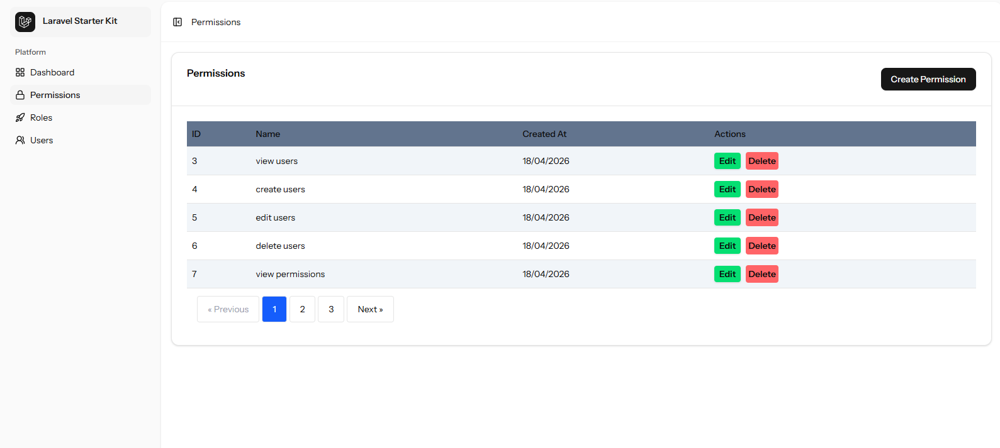
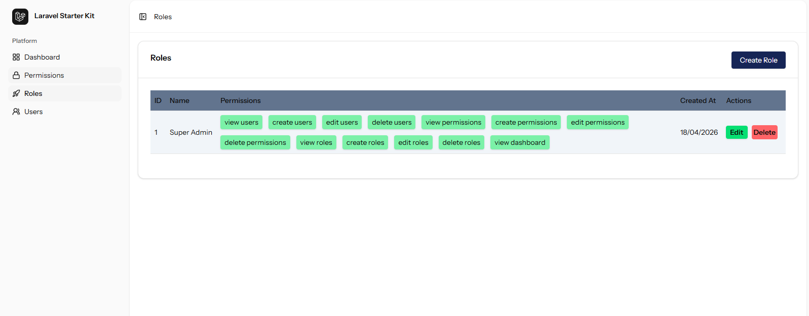
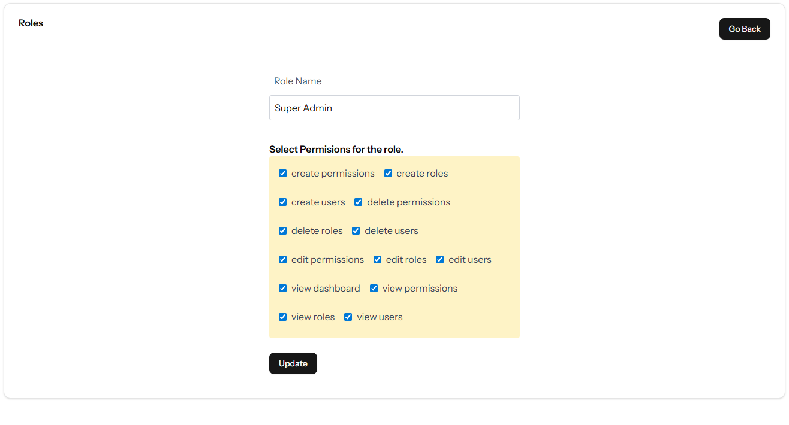
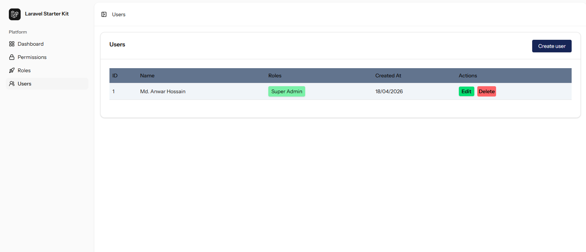
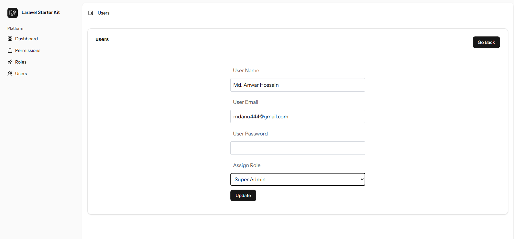

# 🚀 Dynamic Role-Based Access Control System

A modern, full-stack web application built with **Laravel 12**, **React**, and **Inertia.js**. This project was developed as a personal practice to master dynamic permission management and seamless SPA (Single Page Application) experiences.

---

## 🌟 Key Features

* **Dynamic Role & Permission Management:** Create, Edit, and Delete roles and permissions directly from the UI.
* **Fine-grained Access Control:** Assign specific permissions to roles and link roles to users.
* **Modern SPA Experience:** Powered by Inertia.js for a smooth, no-reload user experience using React.
* **Authentication:** Fully secure login and registration system.
* **Data Tables:** Dynamic listing of users and roles with filtering and pagination.
* **Responsive UI:** Clean and modern interface built with [Tailwind CSS].

## 🛠 Tech Stack

-   **Backend:** Laravel 12 (Latest Version)
-   **Frontend:** React.js, Inertia.js
-   **Styling:** Tailwind CSS
-   **Database:** MySQL 
-   **State Management:** Inertia Shared Props & React Hooks



*Permission Management Page*



*Role Management Page*

*Role Edit Page*


*User Management Page*

*Edit User Page*

## 💻 Installation & Local Setup

Follow these steps to get the project running on your local machine:

### 1. Clone the Repository
```bash
git clone [https://github.com/mdanu444/Role-base-permission-in-React-Inertia-Laravel.git](https://github.com/mdanu444/Role-base-permission-in-React-Inertia-Laravel.git)
cd Role-base-permission-in-React-Inertia-Laravel
